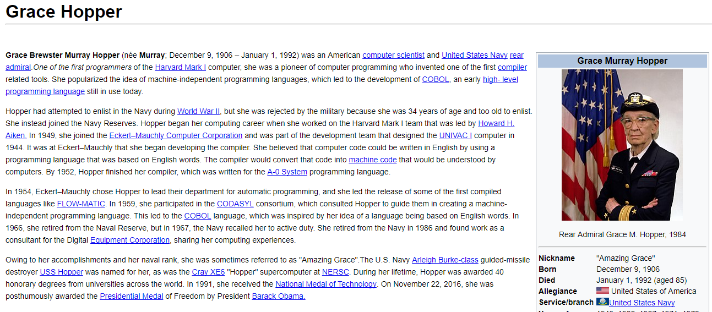
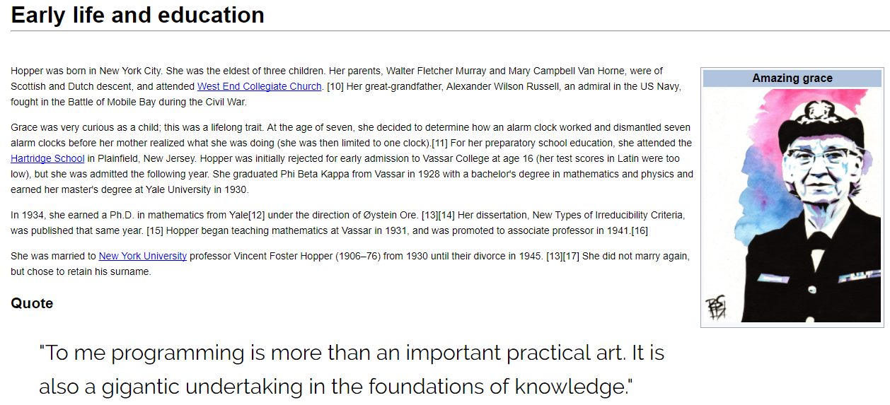

# **Grace Hopper**

- ### **Objetivo**
Construir una réplica de la página de Grace Hopper de *Wikipedia* con los conocimientos básicos de **HTML** y **CSS**.

- ### **Contenido**
Para crear la estructura de la página web y darle estilos particulares a cada sección se usaron etiquetas semánticas, tales como:

      1. <header>
      2. <main>
      3. <aside>
Asimismo, se hizo uso de elementos como: _headings, links, tabla, imagen, horizontal rule y citas_.

 El acabado final es el siguiente:

 **Página principal:**

 

 **Link:**

 
